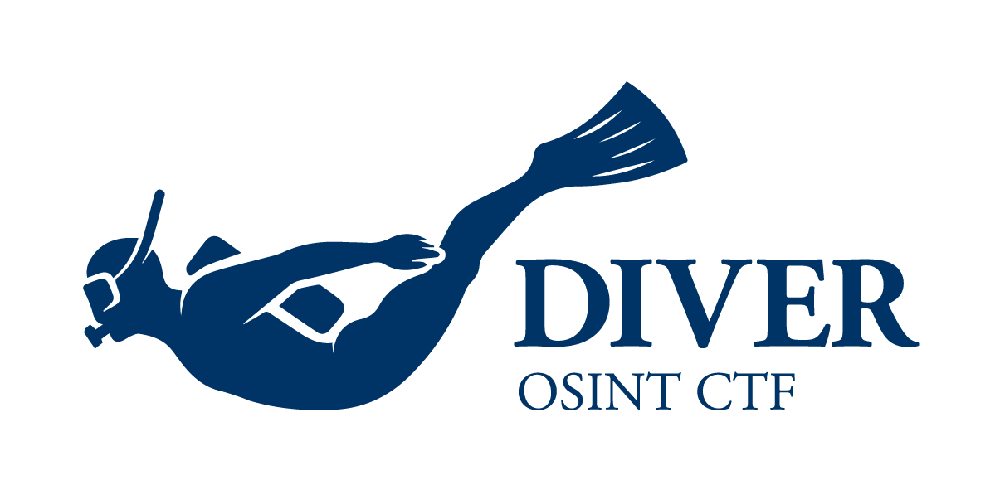

<b>DIVER OSINT CTF</b> is the real-world oriented OSINT CTF. 
We provide country/region-neutral OSINT challenges. 
Challenges will be available in English and Japanese. 

<b>DIVER OSINT CTF</b> は現実世界指向の OSINT CTF（OSINTのコンテスト）です。 
国や地域、レベルを問わず、初心者から上級者まで様々な方々が取り組める問題を出題します。 
出題言語は日本語・英語です。

## Upcoming CTF / 次回開催

### DIVER OSINT CTF 2025

- **2025 June 7th (Sat) 03:00 UTC - June 8th (Sun) 03:00 UTC** (24hrs)
- Team competition (max 6 people per team)
- online
- Registration page will be open June

Stay tuned with following our [X account](https://x.com/DIVER_OSINT_CTF) and joining [Discord server](https://discord.diverctf.org)!

- **2025年6月7日（土）正午 (JST) ～8日（日）正午 (JST)** (24時間)
- チーム戦（1チームあたり最大6名）
- オンライン開催
- 参加登録ページは6月にオープンする予定です

最新情報は[Xのアカウント](https://x.com/DIVER_OSINT_CTF)をフォロー・[Discordサーバ](https://discord.diverctf.org)に参加することで受け取ることができます。

## Links

* Twitter / X: [@DIVER_OSINT_CTF](https://x.com/DIVER_OSINT_CTF)
* Discord Server: [DIVER OSINT CTF](https://discord.diverctf.org)
* CTF Time: [DIVER OSINT CTF](https://ctftime.org/ctf/1111)
* Writeups（過去の問題と解説）: [diver-osint-ctf/writeups](https://github.com/diver-osint-ctf/writeups)

## Contact

公式XアカウントのDMからお問い合わせください。